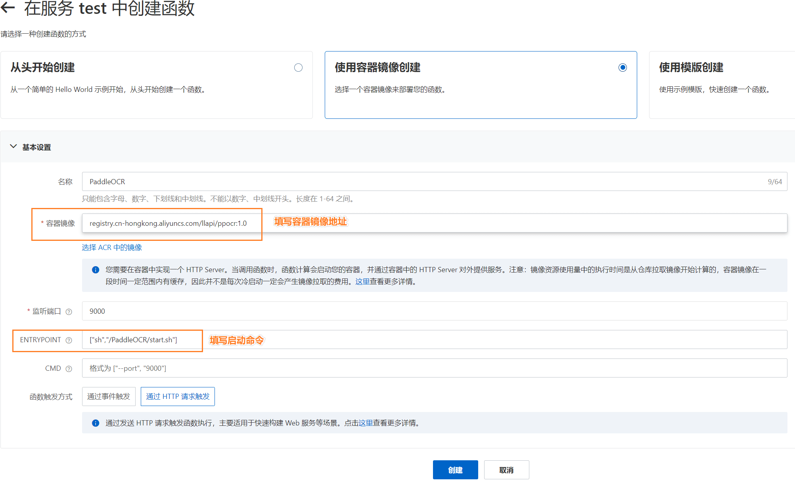
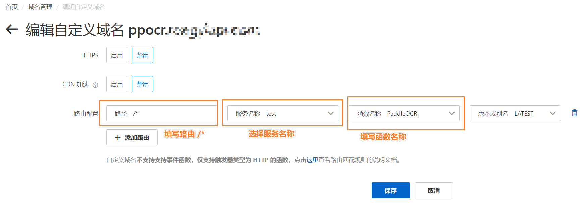
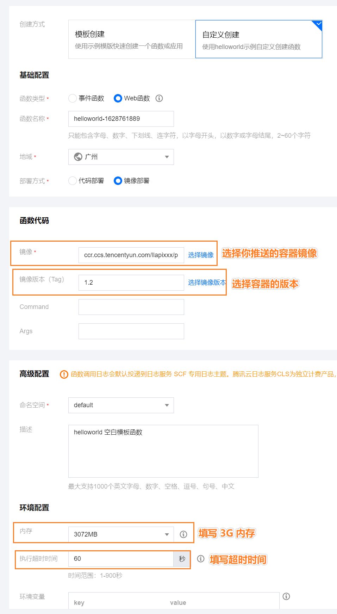

# 基于 Serverless 架构部署通用文字识别 PaddleOCR

[](https://github.com/duolabmeng6/paddlehub_ppocr)
[](https://gitee.com/duolabmeng666/paddlehub_ppocr/stargazers)

# 项目背景

PaddleOCR 旨在打造一套丰富、领先、且实用的OCR工具库，助力使用者训练出更好的模型，并应用落地。

PaddleOCR 项目地址: https://github.com/PaddlePaddle/PaddleOCR

# 开箱即用

这里提供了开箱即用的 docker 镜像，可直接将 PaddleOCR 部署到本地服务器，阿里云函数计算，腾讯云函数中提供通用文字识别 api 接口

[PaddleOCR docker 镜像地址](https://hub.docker.com/repository/docker/duolabmeng666/paddlehub_ppocr)

## 部署 PaddleOCR 到本地

如果国外访问太慢可使用国内的仓库地址

```shell
# docker hub 仓库的地址 (国外地址较慢)
docker run -itd --name ppocr -p 9000:9000 duolabmeng666/paddlehub_ppocr:1.0 /bin/bash -c "sh /PaddleOCR/start.sh"

# 腾讯云的镜像仓库地址
docker run -itd --name ppocr -p 9000:9000 ccr.ccs.tencentyun.com/llapi/pphubocr:1.0 /bin/bash -c "sh /PaddleOCR/start.sh"

# 阿里云的镜像仓库地址
docker run -itd --name ppocr -p 9000:9000 registry.cn-hongkong.aliyuncs.com/llapi/ppocr:1.0 /bin/bash -c "sh /PaddleOCR/start.sh"
```

## 调用 OCR

```
curl -H "Content-Type:application/json" -X POST --data "{\"images\": [\"iVBORw0KGgoAAAANSUhEUgAAAHkAAAAnCAYAAAArfufOAAAEvElEQVR4nO1bMWsbSRT+clyv4sAWGAS5wpUN8UGuSmlQEBHpsp0LgZy4cOkuwhHqrDKFkERcpMqWQZcgkRQurrJBNifjwo3BYEcSpNAv2Huzu5JWu7Pe2dWubDLzNV7P7r5987733rx5Yz8yCFD4pfHbfSugkDwUyRJAkSwBFMkSQJEsARTJEkCRLAEUyRJAkSwBFMkSQJEsAbwkn+nQdqo4PBN4W+jZATrlKrTydww5d4dfGyRDx7mgwg8Vsc+D2bbZE/tuwHO/x6WTL/o9/NsHVvPrWIoqg024fj2XGtnXeyg8mf7OjLPbGoWWs5rfQiW3LPSs8DfSG3i/vzljn/MTmm/3mhznAqWahjXee2QXS/4FOdc6/xmMSe5/R6l8ikvHjU69io7QVJzPplDY30Y27VC2xeRmUGKGsclyGzwQTzToNb+bLFN8xCG8hgpGxt+AHvRwuNPGVSj5wd84b1ZRufWOrxX3oNv2quw0PHY19WGOz3EQNyyS05uo1DatkTBEBD1LzqN3WRSJGtImrM+uvQ4jHZhzvyYbfwZWZm4wO7UpsMiBBBw7wXRNitQpisnTdn2dpYd/zHQzIm+twiJ2D++7LM0lp9kU1/Z3xbHquPam49FUHs279DS8Rn4pvlLm6cnR/6/n0IvrM0O+JIdJ11ycHVkRyYnEqewMCvkU0ErNpDSrQEthJfEoni9dL+W2oeesazPtdmflMcLCwinTg4jLnS/JYdK1B2yNd4671nyn7CiGeHjo4bjrd08gWyTszAmkaztNU9oooW0VFeM1P4YqOV7Ml64nOLuYZL1jiujjp84AiVZ4xYn40zXbMrFKl9aFYbMdXbOFIJ7qmm13VtMpXPavcXVLP+sNrFDRuBGvspERf7pmUbtvXfKaH8EY4PSECo/0n9H31YuEuYPI4Fl+hMtWBtq+BrDoLOtUb4QR5NxZ3I3AAHRtq5JvhojCs26H3fNGwfzpmvUBkN+iqP08GVsrbqHQPAJuwkheRpZ2Flnf+1MnCNOQYXg4JDv36gvDnOmaMplZURfJ4F+dN4iwomYVld2YCi97t5LNb+CqdYTznKjeNsm8vVm0jhe4+7RIsCP7cdju2AIxvB1Rxtk2je2/NMVReE27Wy9ymxje0DvNnrCdTZLv3JvdF/o/zdT9OFaZ7vbtKHS6RusjNLNRY3XkConv5b3drSW2HFDq1poQIvrOdG15mbs3OkevOP0HrWmzhZqfg7EoYVHwd5xRfC9LwjwYr8PMoZzZgK3fz3FDy4cI0dzzZOvYjAgGpV4OkRuUQvWXP7FLz2g7DXQEKkIT6WUzMjsnQUdodruTnGIRFTZzZt6R6Xjc75g0UZjHuHYw1Xg9/HUUahTRt+1ADh5N/xfKUcKHWVcnKZBzAsXLBKINEXsbgIhHgjxMq1KriOq4xof9AZbSnKrVpTNve2nVNSlPWzP0UaPjW8Lty8k7Poc6jOTBl7rx6s2B8eHUiI4f34y3JOPtl/5kqNc4MF69+2YM5hAbL/pG+92BOVennqFgz9M9L8uGn4xewJgbUxv9Z3xgct/UjfaPaKqNeXR/0xHJCr8q1N94SQBFsgRQJEsARbIEUCRLAEWyBFAkSwBFsgT4HxQ8/CE4B3ErAAAAAElFTkSuQmCC\"]}" http://127.0.0.1:9000/predict/ocr_system
```

```
{"msg":"","results":[[{"confidence":0.9853195548057556,"text":"测试图像路径，可以是单张图片路径，也可以是图像集合目录路径","text_region":[[5,10],[466,10],[466,24],[5,24]]}]],"status":"000"}
```

## 调用 OCR 代码示例

[查看调用代码示例](https://github.com/duolabmeng6/paddlehub_ppocr/tree/master/demo)


```python
import requests
from pyefun import *
from pyefun.encoding.ebase64 import *


# 用 docker 部署 PaddleOCR 开箱即用 通用文字识别
# https://github.com/duolabmeng6/paddlehub_ppocr

def ocr(文件地址):
    image = base64编码(读入文件(文件地址))
    data = '{"images":["' + image + '"]}'
    txt = requests.post("http://127.0.0.1:9000/predict/ocr_system", data=data,
                        headers={'Content-Type': 'application/json'})
    return txt.content.decode("utf-8")


print(ocr("./test.png"))

```


## 部署到阿里云函数计算

容器镜像地址 `registry.cn-hongkong.aliyuncs.com/llapi/ppocr:1.0`

启动命令 `["sh","/PaddleOCR/start.sh"]`

需要绑定域名

识别地址就是 http://绑定域名/predict/ocr_system





## 部署到腾讯云函数

1. 需要将镜像推送至腾讯云的镜像仓库
2. 创建云函数

```shell
docker pull duolabmeng666/paddlehub_ppocr:1.2
docker tag duolabmeng666/paddlehub_ppocr:1.2 ccr.ccs.tencentyun.com/llapixxx/ppocr:1.2
docker push ccr.ccs.tencentyun.com/llapixxx/ppocr:1.2
```
推送镜像至腾讯云以后就可以创建云函数了

识别地址就是 https://创建云函数后可以看到.gz.apigw.tencentcs.com/release/predict/ocr_system




# 项目开发

使用 [PaddleHub Serving 的服务部署](https://github.com/PaddlePaddle/PaddleOCR/blob/release/2.2/deploy/hubserving/readme.md)
PaddleOCR

步骤如下：

1. 构建飞浆的运行环境
2. 用 PaddleHub Serving 的服务部署 .
3. 将 PaddleOCR 项目下载回来，编写 Dockerfile 文件
4. 在 Serverless 架构的中部署

# docker 中构建飞浆的运行环境

## 1.构建 python3.7 运行环境

新建以下文件和目录

```
/test_ppocr
-- PaddleOCR (https://github.com/PaddlePaddle/PaddleOCR 项目的文件)
-- Dockerfile (docker 构建的文件)

```

```shell
# 创建 python 的基础的运行环境
docker run -itd --name testppocr -p 9000:9000 -v /test_ppocr:/test_ppocr python:3.7.10-slim /bin/bash #
# 进入容器内安装飞浆的运行环境
docker exec -it testppocr /bin/bash 
```

## 2. 安装依赖

```shell
apt install g++
apt install libglib2.0-dev
apt install libgl1-mesa-glx
apt install libsm6
apt install libxrender1

# 离线下载 python 安装包 由于构建时经常重试所以下载离线包调试速度会加快
pip download -r requirements.txt -d ./pg
pip download paddlepaddle==2.0.2 -i https://mirror.baidu.com/pypi/simple -d ./pg
pip download paddlehub -d ./pg

# 安装 python 包
pip install -r requirements.txt --find-links ./pg
pip install paddlepaddle --find-links ./pg
pip install paddlehub -U --no-index --find-links ./pg

```

用 PaddleHub Serving 的服务部署

```shell
hub install deploy/hubserving/ocr_system/
hub install deploy/hubserving/ocr_cls/
hub install deploy/hubserving/ocr_det/
hub install deploy/hubserving/ocr_rec/
```

到这里 PaddleHub Serving 运行环境就安装好了 运行起来看一下效果

```shell
hub serving start --modules ocr_system ocr_cls ocr_det ocr_rec -p 9000
```

测试没问题，到这里运行镜像就构建好了

将容器内无用文件删除减小容器的体积

```shell
rm -rf /root/.cache/* \
&& rm -rf /var/lib/apt/lists/* \
&& rm -rf /app/test/pg/*
```

## 编写 Dockerfile

上面的过程是构建飞浆的基础运行环境的 那么以后就可以用该基础镜像部署任意飞浆模型了

```
FROM registry.cn-hongkong.aliyuncs.com/llapi/pphub:base

COPY PaddleOCR /PaddleOCR

WORKDIR /PaddleOCR

RUN mkdir -p /PaddleOCR/inference/
ADD https://paddleocr.bj.bcebos.com/dygraph_v2.0/ch/ch_ppocr_mobile_v2.0_det_infer.tar /PaddleOCR/inference/
RUN tar xf /PaddleOCR/inference/ch_ppocr_mobile_v2.0_det_infer.tar -C /PaddleOCR/inference/

ADD https://paddleocr.bj.bcebos.com/dygraph_v2.0/ch/ch_ppocr_mobile_v2.0_cls_infer.tar /PaddleOCR/inference/
RUN tar xf /PaddleOCR/inference/ch_ppocr_mobile_v2.0_cls_infer.tar -C /PaddleOCR/inference/

ADD https://paddleocr.bj.bcebos.com/dygraph_v2.0/ch/ch_ppocr_mobile_v2.0_rec_infer.tar /PaddleOCR/inference/
RUN tar xf /PaddleOCR/inference/ch_ppocr_mobile_v2.0_rec_infer.tar -C /PaddleOCR/inference/

RUN hub install deploy/hubserving/ocr_system/
RUN hub install deploy/hubserving/ocr_cls/
RUN hub install deploy/hubserving/ocr_det/
RUN hub install deploy/hubserving/ocr_rec/

EXPOSE 9000

CMD ["/bin/bash","-c","hub serving start --modules ocr_system ocr_cls ocr_det ocr_rec -p 9000"]
```

# 在 Serverless 架构的中部署

需要将docker镜像推送至对应平台的镜像仓库中

这里以阿里云容器镜像仓库作为例子

请自行修改参数推送，这里是我的账户命令

```shell
docker commit testppocr paddlehub_ppocr:1.0
docker tag paddlehub_ppocr:1.0 registry.cn-hongkong.aliyuncs.com/llapi/ppocr:1.0
docker push registry.cn-hongkong.aliyuncs.com/llapi/ppocr:1.0
```


## 部署到阿里云函数计算

容器镜像地址 `registry.cn-hongkong.aliyuncs.com/llapi/ppocr:1.0`

启动命令 `["sh","/PaddleOCR/start.sh"]`

需要绑定域名

识别地址就是 http://绑定域名/predict/ocr_system


## 部署到腾讯云函数计算

由于腾讯云云函数容器的文件的限制只允许 `/tmp` 可读可写，所以我们需要修改代码以支持云函数的部署。

这里我已经构建好了可以直接使用。

1. 需要将镜像推送至腾讯云的镜像仓库
2. 创建云函数

```shell
docker pull duolabmeng666/paddlehub_ppocr:1.2
docker tag duolabmeng666/paddlehub_ppocr:1.2 ccr.ccs.tencentyun.com/llapixxx/ppocr:1.2
docker push ccr.ccs.tencentyun.com/llapixxx/ppocr:1.2
```

推送镜像至腾讯云的成功以后就可以创建云函数了
识别地址就是 https://创建云函数后可以看到.gz.apigw.tencentcs.com/release/predict/ocr_system


### 解决方案

* 了解 docker 镜像制作与推送
* 云函数中报错解决思路

### 分析 docker 中写出的文件

将我们前面部署好的镜像，在自己电脑上运行起来

```shell
docker run -itd --name ppocr -p 9000:9000 ccr.ccs.tencentyun.com/llapi/pphubocr:1.0
```

查看文件差异信息 发现运行了以后在非 /tmp 目录进行了写文件操作 所以导致在云函数中无法启动容器。
现在我们要做的事情就是将路径处理到 /tmp 中

```shell
docker diff ppocr
C /root
C /root/.paddlehub
C /root/.paddlehub/conf
A /root/.paddlehub/conf/serving_9000.json
C /root/.paddlehub/log
A /root/.paddlehub/log/HubServing-2021_08_12.log
```

通过查看源代码可以发现 `/paddlehub/env.py` 是控制这些文件写出目录的文件

将文件复制出来放置 `./tx/env.py` 并在最后增加以下代码

```shell
CONF_HOME = "/tmp"
LOG_HOME = "/tmp"
TMP_HOME = "/tmp"
```

### 编写 Dockerfile

在项目目录中创建文件 `Dockerfile_TX`

```shell
FROM ccr.ccs.tencentyun.com/llapi/pphubocr:1.0

WORKDIR /PaddleOCR

COPY ./tx/env.py /usr/local/lib/python3.7/site-packages/paddlehub/env.py

CMD ["/bin/bash","-c","hub serving start --modules ocr_system ocr_cls ocr_det ocr_rec -p 9000"]
```

### 构建镜像测试

```shell
docker build -f ./Dockerfile_TX -t paddlehub_ppocr:1.0 .
docker rm -f ppocr
docker run -itd --name ppocr -p 9003:9000 paddlehub_ppocr:1.0
docker logs ppocr
docker diff ppocr
```

可以发现镜像在镜像中依然存在非 /tmp 文件的读写 但是这些文件在保存容器镜像以后 不会在读写 所以接下来只需要保存镜像推送即可

```shell
docker diff ppocr
C /usr
C /usr/local
C /usr/local/lib
C /usr/local/lib/python3.7
C /usr/local/lib/python3.7/site-packages
C /usr/local/lib/python3.7/site-packages/paddlehub
C /usr/local/lib/python3.7/site-packages/paddlehub/__pycache__
C /usr/local/lib/python3.7/site-packages/paddlehub/__pycache__/env.cpython-37.pyc
C /tmp
A /tmp/HubServing-2021_08_12.log
A /tmp/cache.yaml
A /tmp/config.yaml
A /tmp/serving_9000.json
```

### 打包镜像推送

```shell
# 保存镜像
docker commit ppocr ccr.ccs.tencentyun.com/llapi/pphubocr:1.2

# 测试一下这个镜像是否还存文件读写的情况 没有问题的话就可以推送了
docker rm -f ppocr
docker run -itd --name ppocr -p 9000:9000 ccr.ccs.tencentyun.com/llapi/pphubocr:1.2
docker logs ppocr
docker diff ppocr

# 经过前面的检查确定镜像没有问题，推送镜像
docker push ccr.ccs.tencentyun.com/llapi/pphubocr:1.2
```

### 在腾讯云函数中创建

选择镜像直接部署就可以拿到识别地址了


# 总结

在 Serverless 架构下部署深度学习模型变得非常简单且能提供无限的并发支持，我们可以将镜像部署到各个提供 Serverless 的服务商中，可提供稳定可靠弹性的推理服务。

# 鸣谢各厂商大佬提供的技术支持

* 腾讯云函数 https://cloud.tencent.com/product/scf
* 阿里云函数计算 https://www.aliyun.com/product/fc

# 学习交流

pyefun 易函数 qq群:1017240979

# 项目相关

pyefun 易函数 https://github.com/duolabmeng6/pyefun

为python提供强大且易用的中文函数库，完整的封装了易语言核心支持库所有功能，以及易语言中简单易用的函数
